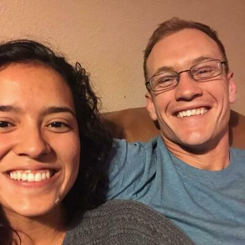

<title>Ryan King</title>
<link rel="stylesheet" type="text/css" media="all" href="./index.css"/>

  

Welcome to my webpage

I am Computer Science major at Texas A&M. I do research with Dr Zhangyang "Atlas" Wang in Self Supervised NAS. Additionally, I am an instructor at the [Texas A&M Data Analytics Club](https://maroonlink.tamu.edu/organization/aggieanalytics). Click [here](https://github.com/texas-a-m-data-analytics-club) to checkout some of the workshops we create. 

